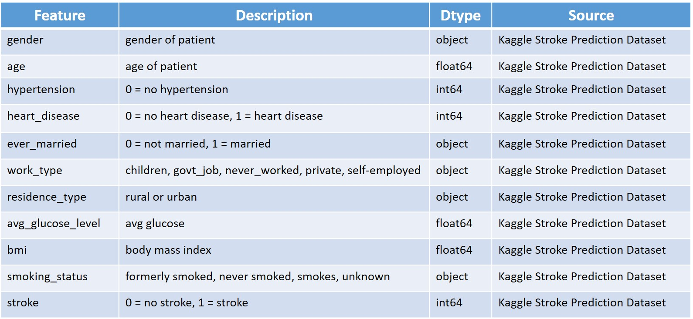
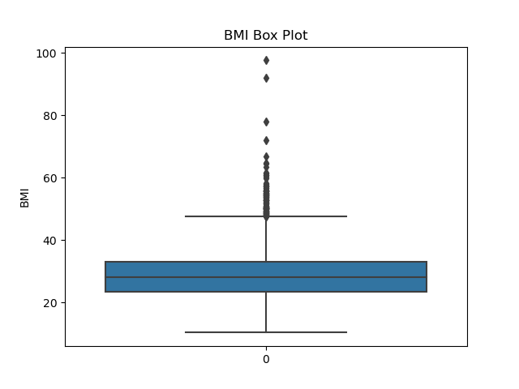
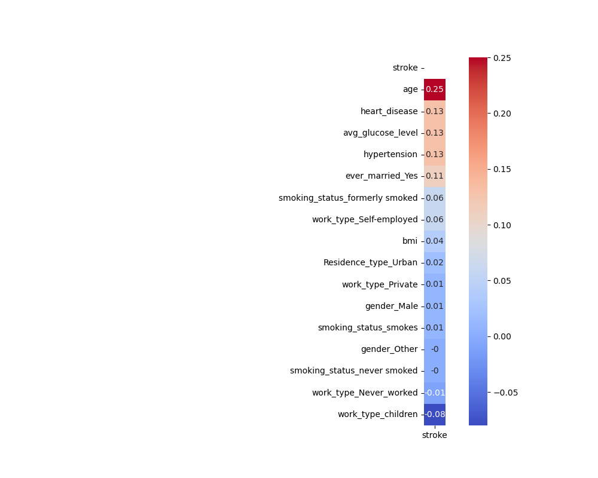
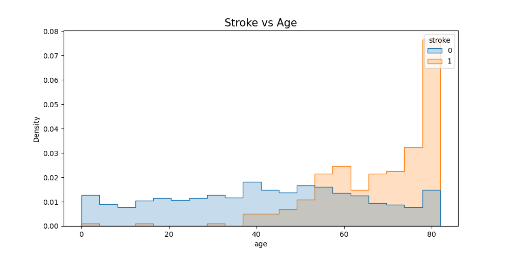
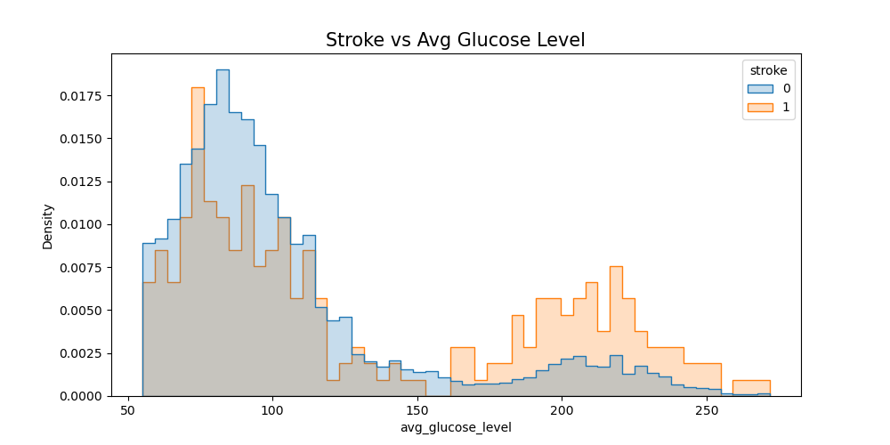
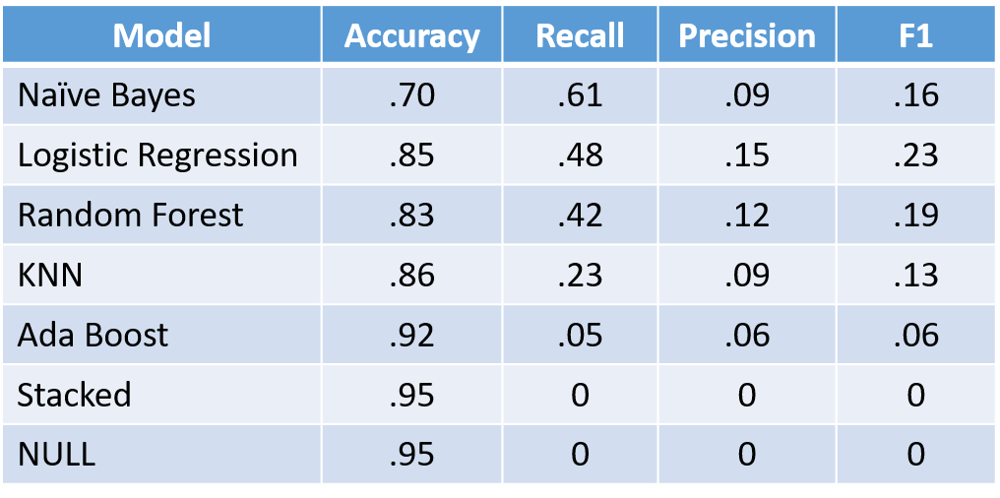
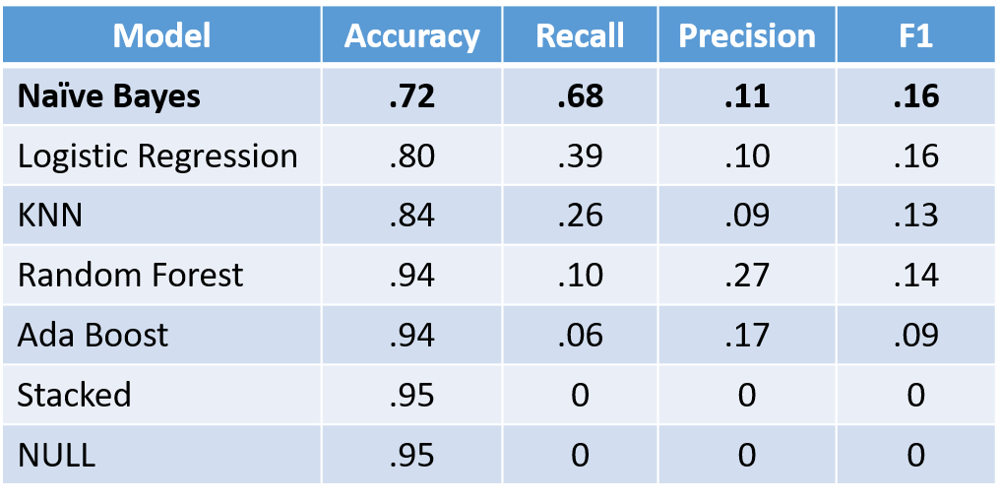

# Stroke Prediction using Machine Learning Models

## Background
---
Stroke is the second leading cause of death in the world, accounting for nearly 11% of all deaths, according the World Health Organization (WHO). A stroke occurs when blood supply is cut or reduced to a portion of the brain, thereby reducing oxygen to that particular area. Within minutes of losing blood supply, brain cells begin to die. It is imperative to examine the causes and indicators of stroke in order to perform proper intervention before it is too late.

## Problem Statement
---
We were tasked to predict whether a patient will have a stroke episode based on 11 various features such as gender, age, hypertension, and bmi.  These findings will be used to flag potential high-risk patients for physicians to further investigate. 

We maximized for the Recall metric to make sure that we do not falsely identify patients as a non-stroke risk. False positives are not as much of a concern because of the intended use of the model to identify potential high-risk patients.

### 1. Stroke data information:

*11 features
*5,110 patient samples.
*4,861 non stroke patients and 249 stroke patients.
    
### 2. Data Dictionary:

source: https://www.kaggle.com/datasets/fedesoriano/stroke-prediction-dataset

### 3. Cleaning and Exploratory Data Analysis:

The data had 201 missing data points for BMI. For this we replaced these points with the median figure for all of the BMI data points since there were a few outliers. It was determined to keep the higher outliers in BMI, as shown below, since these BMI figures accurately represent patients who may be at higher risk of stroke.

The correlations of the features in relation to a stroke occurance were low. The most highly correlated feature to predicting a stroke occurance is age, followed by heart disease, average glucose level, hypertension, and marriage status.

There is a clear relation between age and stroke episodes in the data.

The relation between glucose levels and stroke are less pronounced. However, over the average glucose level of 150 the chances of stroke greatly increases.

#### Imbalanced Classes

The patient data contained highly imbalanced classes with 4,861 non-stroke patients and 249 stroke patients. In order to properly evaluate and predict the occurance of a stroke, we used the Synthetic Minority Oversampling Technique (SMOTE) on the training set and kept the test set in tact in order to properly evaluate the models. SMOTE creates synthetic data entries that mirror the minority class, which in this case are patients with stroke.

#### Feature Engineering

To further explore realtionships among features and the target of having a stroke, Polynomial features with an n=3 were explored on models. From the 11 original features, 969 features were created.

### 4. Model Performance:

#### Original 11 Features

The highest performing model that maxmizes the Recall metric is Naive Bayes with a Recall of 61% and an Accuracy of 70%. Although the Accuracy is lower than the Null Model figure of 95%, the Recall metric far higher than the 0% in the Null Model.

#### Polynomial Features

The highest performing model with Polynomial Features that maxmizes the Recall metric is Naive Bayes with a Recall of 68% and an Accuracy of 72%. Although the Accuracy is lower than the Null Model figure of 95%, the Recall metric far higher than the 0% in the Null Model.

## Conclusion & Next Steps
---
Although Naïve Bayes with Polynomial Features has a lower Accuracy score than the Null Model it has a significantly higher Recall score. This can be helpful in screening for high risk patients for further investigation while reducing false negatives.

Future steps can be to further refine the models to increase for both Recall and Accuracy.  The distributions of highly correlated features especially average glucose level can be examined and adjusted to increase model performance for Recall. Naive Bayes may have been the highest performing model because of interesting distributions in BMI and Average Glucose Levels.

